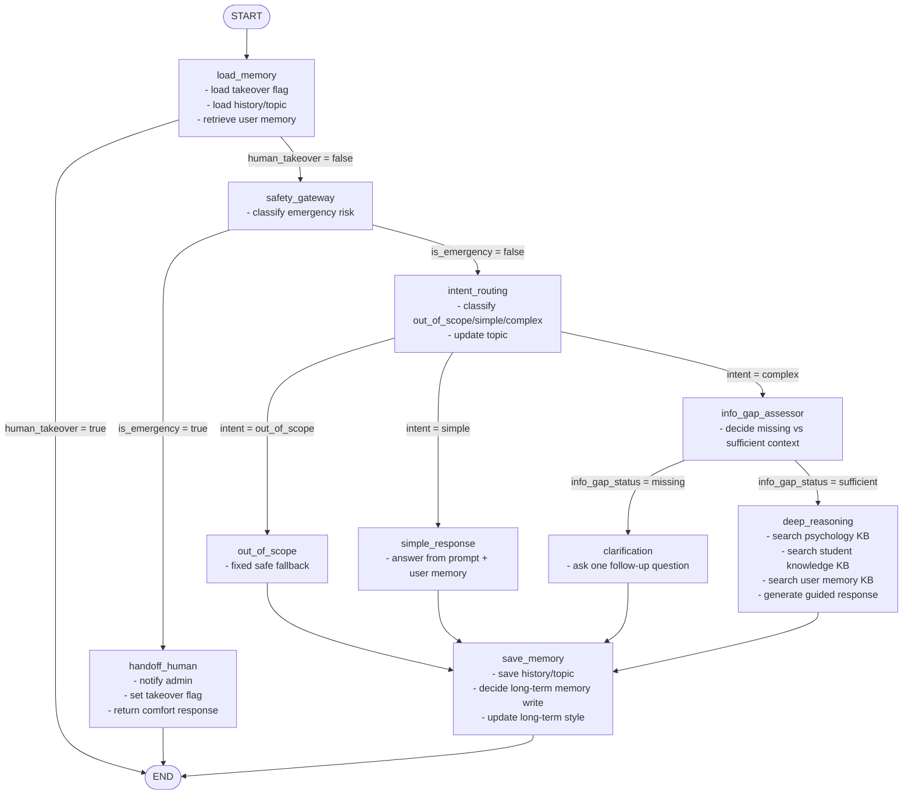

# Agent Flow

Tai lieu nay tom tat luong agent chinh trong repo, dua tren graph duoc build tai `graph/workflow.py` va luong goi graph tu WebSocket tai `api/chat_ws.py`.

## 1. Core counseling graph



## 2. Runtime entry flow from WebSocket

```mermaid
flowchart TD
    A[Student WS connect\n/ws/chat/{user_id}] --> B[Validate origin]
    B --> C[Accept socket]
    C --> D[Load recent history + current topic]
    D --> E[Send connection_acknowledged]
    E --> F[Receive student message]
    F --> G[build_counseling_graph]
    G --> H[graph.ainvoke(state)]
    H --> I[Send bot_response]
    I --> J[Publish admin alert]
    J --> K{Emergency or takeover?}
    K -->|Yes| L[Publish emergency alert]
    K -->|No| M[Wait next message]
    L --> M
    M --> F
```

## 3. Routing conditions

- `load_memory -> END`: khi `human_takeover` da duoc bat truoc do.
- `safety_gateway -> handoff_human`: khi LLM tra ve emergency.
- `intent_routing -> out_of_scope | simple_response | info_gap_assessor`: dua tren `intent_category`.
- `info_gap_assessor -> clarification | deep_reasoning`: dua tren `info_gap_status`.

## 4. Luu y quan trong

- `deep_reasoning_node` co the dat `human_takeover = true` khi phat hien escalation pattern trong student knowledge, nhung graph hien tai van di tiep qua `save_memory` roi moi ket thuc.
- Thong tin `human_takeover` sau `deep_reasoning` duoc lop goi ben ngoai doc va phat alert trong WebSocket layer.
- Entry point CLI dung `workflow()` trong `main.py`, con API runtime dung `build_counseling_graph()` truc tiep.

## 5. Nguon tham chieu

- `graph/workflow.py`
- `graph/edges.py`
- `graph/nodes.py`
- `api/chat_ws.py`
- `main.py`
